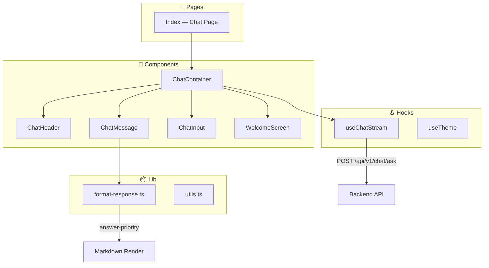

# HistoryMind AI — Frontend

Giao diện chat tương tác cho hệ thống Chatbot Lịch sử Việt Nam. Được xây dựng với **React 18**, **TypeScript**, **Vite**, và **TailwindCSS**.

## 🏗 Kiến trúc



### Luồng xử lý

1. User gõ câu hỏi → `ChatInput` → `useChatStream` hook
2. Hook gọi **Backend** API (`POST /api/v1/chat/ask`)
3. Response trả về → `format-response.ts` xử lý
4. **Answer-Priority Logic**: Nếu `answer` đã chứa thông tin sự kiện → render answer, KHÔNG render `events[]` lần nữa (tránh duplication)
5. `ChatMessage` render markdown với `react-markdown`

### Answer-Priority Logic (`format-response.ts`)

```
Response từ API: { answer, events[], intent, ... }

if (answer chứa nội dung đầy đủ):
    → Render answer (markdown)
    → SKIP events (tránh duplicate)
else:
    → Render answer
    → Render events dưới dạng timeline cards
```

---

## 🧩 Components

| Component | Vai trò |
|-----------|---------|
| `ChatContainer` | Layout chính, quản lý state messages |
| `ChatHeader` | Header với title + theme toggle |
| `ChatMessage` | Render tin nhắn user/bot, markdown support |
| `ChatInput` | Input field + send button |
| `WelcomeScreen` | Màn hình chào + suggested questions |

## 🪝 Hooks

| Hook | Vai trò |
|------|---------|
| `useChatStream` | Quản lý chat state, API calls, loading states |
| `useTheme` | Dark/Light mode toggle |
| `use-mobile` | Responsive detection |

---

## 🛠 Cài đặt & Chạy

### Yêu cầu

- Node.js 18+
- npm hoặc yarn

### Local Development

```bash
# 1. Cài dependencies
npm install

# 2. Tạo .env.local (sử dụng Vite proxy → localhost:8080)
echo "VITE_API_URL=" > .env.local

# 3. Chạy dev server
npm run dev
# → http://localhost:3000
```

> **Lưu ý**: Backend cần chạy trên port `8080` để Vite proxy hoạt động.

### Production (Vercel)

Env var cần set:
```
VITE_API_URL=https://behistorymindai-production.up.railway.app
```

---

## 🧪 Testing

```bash
# Unit tests (Vitest)
npm test

# Watch mode
npm run test:watch
```

| Test file | Nội dung |
|-----------|---------|
| `format-response.test.ts` | Answer-priority logic, event formatting |
| `chat-integration.test.ts` | Chat flow integration |

---

## 📂 Cấu trúc

```
FE_HistoryMind_AI/
├── src/
│   ├── components/
│   │   ├── chat/                  # Chat UI components
│   │   │   ├── ChatContainer.tsx
│   │   │   ├── ChatHeader.tsx
│   │   │   ├── ChatMessage.tsx
│   │   │   ├── ChatInput.tsx
│   │   │   └── WelcomeScreen.tsx
│   │   └── ui/                    # Shadcn/ui components
│   ├── hooks/
│   │   ├── useChatStream.ts       # Chat state + API
│   │   └── useTheme.ts            # Theme toggle
│   ├── lib/
│   │   ├── format-response.ts     # Answer-priority logic
│   │   └── utils.ts               # Utilities
│   ├── pages/
│   │   └── Index.tsx              # Main chat page
│   └── test/                      # Vitest test files
├── package.json
├── vite.config.ts
└── tailwind.config.ts
```

## 📚 Tech Stack

| Thành phần | Công nghệ |
|-----------|-----------|
| Framework | React 18 + TypeScript |
| Build | Vite 7 |
| Styling | TailwindCSS 3 + Shadcn/ui |
| Animation | Framer Motion |
| Markdown | react-markdown |
| Testing | Vitest + Testing Library |
| Deploy | Vercel |
